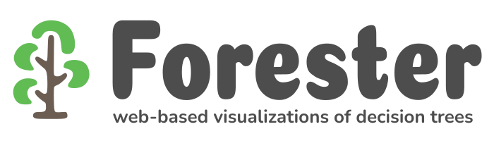

<a name="readme-top"></a>

[![Contributors][contributors-shield]][contributors-url]
[![Forks][forks-shield]][forks-url]
[![Stargazers][stars-shield]][stars-url]
[![Issues][issues-shield]][issues-url]
[![MIT License][license-shield]][license-url]


<br />
<div align="center">
  <a href="https://github.com/HydroSysPotsdam/Forester">
    
  </a>

  <p align="center">
    <a href="https://hydrosyspotsdam.github.io/Forester/"><strong>Explore the docs »</strong></a>
    <br />
    <a href="https://github.com/HydroSysPotsdam/Forester/issues/new?assignees=&labels=bug&template=bug-report.md&title=">Report Bug</a>
    ·
    <a href="https://github.com/HydroSysPotsdam/Forester/issues/new?assignees=&labels=feature-request&template=feature-request.md&title=">Request Feature</a>
  </p>
</div>

## Quickstart

To run Forester, you need to have a working installation of Python and a web-browser of you choice.

You can install Forester by cloning the GitHub repository to you machine. When you have installed Git, this can be 
done by running the command:

```
git clone https://github.com/HydroSysPotsdam/Forester.git
```

Alternatively you can also download a compressed version of Forester directly from the GitHub repository by clicking 
*Code* and *Download Zip*. Please decompress the archive at a suitable location.

Forester needs some dependencies to work correctly. You will find a list of them under `Forester/requirements.txt`. You can install the dependencies using pip or conda:

```
pip install -r requirements.txt
```
```
conda install --yes --file requirements.txt
```

Congratulations! Forester can now be started by navigating to its root directory 
and calling

```
python run.py
```

This will start a local webserver. In the terminal, it will display the address that is used to access the server. By default this is [127.0.0.1:8000](127.0.0.1:8000). Open this link in your preferred browser and you should see Forester's project dashboard. If you can't access the website, check whether a different address or port are displayed in the terminal.

Learn more about Forester by reading the section [Getting Started](https://hydrosyspotsdam.github.io/Forester/editor.html) in the docs.

## About The Project

## Testing
Thank you so much for concidering to test Forester. It would really help a lot!

We have provided some guidelines and tips for testing Forester on the [related page](https://hydrosyspotsdam.github.io/Forester/test.html) in the documentation. 

## License
Distributed under the [GPL-3.0][license-url] license.

## Contact Us

Made with <span class="fa fa-solid fa-heart"></span> in Potsdam. For further questions, send a mail to 💌 [David Strahl](<mailto:david.strahl@uni-potsdam.de>) or 💌 [Robert Reinecke](<mailto:robert.reinecke@uni-potsdam.de>).


<!-- MARKDOWN LINKS & IMAGES -->
<!-- https://www.markdownguide.org/basic-syntax/#reference-style-links -->
[contributors-shield]: https://img.shields.io/github/contributors/HydroSysPotsdam/Forester.svg?style=for-the-badge
[contributors-url]: https://github.com/HydroSysPotsdam/Forester/graphs/contributors
[forks-shield]: https://img.shields.io/github/forks/HydroSysPotsdam/Forester.svg?style=for-the-badge
[forks-url]: https://github.com/HydroSysPotsdam/Forester/network/members
[stars-shield]: https://img.shields.io/github/stars/HydroSysPotsdam/Forester.svg?style=for-the-badge
[stars-url]: https://github.com/HydroSysPotsdam/Forester/stargazers
[issues-shield]: https://img.shields.io/github/issues/HydroSysPotsdam/Forester.svg?style=for-the-badge
[issues-url]: https://github.com/HydroSysPotsdam/Forester/issues
[license-shield]: https://img.shields.io/badge/License-GPLv3-lightgrey.svg?style=for-the-badge
[license-url]: https://opensource.org/license/gpl-3-0/
[linkedin-shield]: https://img.shields.io/badge/-LinkedIn-black.svg?style=for-the-badge&logo=linkedin&colorB=555
[linkedin-url]: https://linkedin.com/in/linkedin_username
[product-screenshot]: images/screenshot.png
[Next.js]: https://img.shields.io/badge/next.js-000000?style=for-the-badge&logo=nextdotjs&logoColor=white
[Next-url]: https://nextjs.org/
[React.js]: https://img.shields.io/badge/React-20232A?style=for-the-badge&logo=react&logoColor=61DAFB
[React-url]: https://reactjs.org/
[Vue.js]: https://img.shields.io/badge/Vue.js-35495E?style=for-the-badge&logo=vuedotjs&logoColor=4FC08D
[Vue-url]: https://vuejs.org/
[Angular.io]: https://img.shields.io/badge/Angular-DD0031?style=for-the-badge&logo=angular&logoColor=white
[Angular-url]: https://angular.io/
[Svelte.dev]: https://img.shields.io/badge/Svelte-4A4A55?style=for-the-badge&logo=svelte&logoColor=FF3E00
[Svelte-url]: https://svelte.dev/
[Laravel.com]: https://img.shields.io/badge/Laravel-FF2D20?style=for-the-badge&logo=laravel&logoColor=white
[Laravel-url]: https://laravel.com
[Bootstrap.com]: https://img.shields.io/badge/Bootstrap-563D7C?style=for-the-badge&logo=bootstrap&logoColor=white
[Bootstrap-url]: https://getbootstrap.com
[JQuery.com]: https://img.shields.io/badge/jQuery-0769AD?style=for-the-badge&logo=jquery&logoColor=white
[JQuery-url]: https://jquery.com 