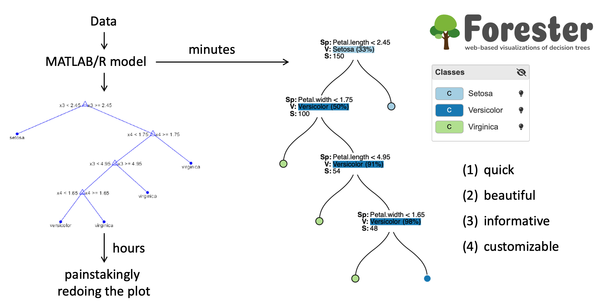

# Summary

Forester is a web-based and open-source software that produces visually appealing tree-based illustrations of 
already trained classification trees from arbitrary libraries or languages (currently Matlab and R).  It creates 
publication-quality plots, that are, at the same time, interactive figures that can guide the user in exploring 
their tree-based models. By using each aspect of the visualization (e.g., colors, node illustrations, links, …) to 
convey information, different statistical and structural aspects of the model can be highlighted. Visualizations can 
be streamlined to the user's requirements and offer a wide variety of insightful techniques. Forester improves on 
the often inadequate transparency, interpretability, and explainability of the underlying models.

# Statement of Need

Tree-based methods such as classification trees are well-established and widely used [@loh]. However, they are often hard to interpret as it is unclear how algorithms arrive at a resulting tree and how robust this tree is with respect to the underlying data [@sarailidis]. These issues can be problematic in both research studies and in practical usage, where results should be transparent, interpretable, and explainable [@roscher] or when models should mirror well-known physical processes as is the case in the natural sciences [@sarailidis]. 

To overcome these issues, adequate visualization can be employed. Visualization can guide users with model 
interpretation, improve model comprehension [@roscher; @liu] and help to diagnose biases and errors. Additionally, it helps to communicate results to a non-technical audience by providing an intuitive way of representing the findings.
 
However, established tree visualization routines used across common statistical, numerical and machine-learning 
environments frequently fall short of their full potential. Tools provided by Python, R or Matlab create only 
rudimentary graphical representations that could be more visually appealing and helpful in conveying a clear message.
They focus on illustrating the statistical properties of the model, but at the same time fail to illustrate or allow 
exploration of the tree’s structure and its implications [@sarailidis]. Promising open-source approaches like 
PaintingClass [@teoh], BaobabView [@van_den_elzen] or dTreeViz [@parr], that equally try to overcome these issues by 
including interactivity exist, but seem to be discontinued. 

# Forester

Forester overcomes these issues by introducing modularity and interactivity into the tree visualization process. The 
user thus becomes an integral part in building the figures and ceases to be an observer only. This encourages model exploration and increases comprehension. Forester further enables the user to create high-quality visualizations on the fly that can be used in publications.

By designing Forester primarily as a tool for the visualization of already trained models we achieve a high 
interoperability between libraries or languages. Forester takes these models and converts them into a generalized 
format that is visualized in a web browser. In the released version, Forester comes with parsers for Matlab and R 
models. Fig. 1 shows how Forester can be used to quickly improve the illustrations of a Matlab model.

Forester runs on a local Python web-server and is accessible using any browser. All visualizations are done within the browser. This client-server approach allows Forester to build on the strengths of modern web illustration libraries and SVG graphics to easily build interactive figures. 

Nodes within the tree are illustrated using what we call “views”. These are small, summarizing plots that allow a unique perspective onto a node and are drawn at the node’s location. Each view focuses on one aspect of the node only, e.g., the class distribution, the split variable or the flow of samples within the tree. The user now decides on what kind of representation should be shown by switching between views and streamlining the informational content of each one.

The same is true for the links that connect nodes, as well as their placement. Layout settings may be changed to the user’s preference to declutter figures. Within the links, the sample number and classes can be encoded to understand what parts of the tree are not relevant and could be pruned.

Forester treats color as an important mean for communication, too. Legend entries are generated for all classes and features and can be individually colored or grouped. By hiding some entries in the legend, the user can highlight individual features and gain an overview of their distribution in the tree. 

# Model Exploration

As an exemplary application, Fig. 2 shows a decision tree created from Fisher’s Iris data using 
Matlab that was illustrated with Forester. There are four available features and three classes. Forester very 
quickly clarifies that two out of the four features have not been used and seem to be unimportant. This can be 
learned by employing the split-view for all internal nodes. Additionally, by enabling the class flow representation in the links, it becomes evident that the tree could be pruned after the first petal-width split. The class distribution is already quite pure, and the two succeeding splits only introduce unnecessary complexity.

# Limitations and Further Work

In a first version of Forester, some features have been omitted that can be implemented at a later time. While 
Forester currently supports output from Matlab and R, the inclusion of common classification tree libraries from 
Python (sklearn) would be beneficial. An extension to regression trees would further increase the applicability of the 
software. Data-driven illustrations of the feature space or importance measures like partial dependence plots are planned but not yet implemented.

Our vision for Forester is to bring standard tree visualization to a higher level, by creating a human-in-the-loop 
experience [@sarailidis]. We understand this as including the user in the tree training process to combine the 
benefits of machine-learning algorithms with the expert’s knowledge and intuition. The user could force or constrain 
certain decisions onto the tree that are deemed to be plausible, create compound features and decide on pruning, 
split variables and threshold selection. Training is then done iteratively where the user’s assessment of how well 
the model recreates known physical processes is included in determining the “goodness” of a tree. We think that this 
approach has the potential to greatly improve the transparency, interpretability and explainability of the model.

# Figures

# Acknowledgements and Author Contributions

We acknowledge support from the Alexander von Humboldt Foundation in the framework of the Alexander von Humboldt Professorship endowed by the German Federal Ministry of Education and Research (BMBF).

DS, RR, and TW designed the software and wrote the paper. DS implemented the majority of the software. RR designed the initial software architecture. RR and TW supervised DS in his work.

# References